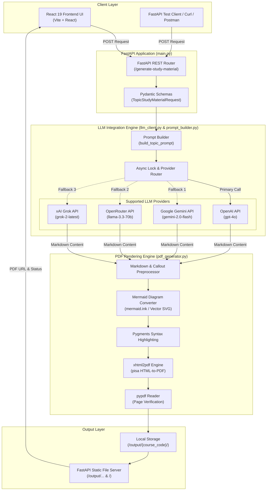

# Topic-Based Academic Study Material Generator — Project Documentation

Welcome to the official documentation for the **Topic-Based Academic Study Material Generator**. This document details the purpose, architecture, workflow, component breakdown, API endpoints, environment setup, and installation instructions for this system.

---

## 1. Executive Summary & Overview

### What is this Project?
The **Topic-Based Academic Study Material Generator** is an automated, AI-powered system engineered to generate comprehensive, publication-grade academic study guides and PDF textbooks for university-level topics.

Given course details (Subject Name, Course Code, Unit Number/Title) and a list of specific topics with allocated learning durations, the platform leverages Large Language Models (LLMs) to construct detailed study modules. The generated content includes:
- **Academic Learning Outcomes & Core Theory** (syllabus-aligned and Bloom's Taxonomy compliant)
- **Source-First Content Policy**: Strict alignment with user-supplied syllabus, textbook, and curriculum context without fabricated citations, RFCs, or generic filler
- **Technical Credibility & Precision**: Absolute statement prevention, precise Acknowledgment Number definitions with numerical step-by-step traces, distinction of Error Detection vs Error Recovery vs Error Correction, and Flow Control vs Congestion Control
- **Worked Numerical Examples**: Mandatory step-by-step calculations for sequence numbers, window sizes, MSS, RTT, subnetting, and formulas
- **Common Misconceptions**: Dedicated section contrasting 2-3 student misunderstandings (e.g. ACK indicates next byte expected, NOT last byte received)
- **Visual Diagrams & Flowcharts** (Structured `StructuredDiagram` data model engine in `diagram_generator.py`: 100% crisp vector SVG rendering, 0 empty boxes or placeholder shapes, step titles, concise descriptions, decision logic diamonds, explicit YES/NO branches, and clean connector arrows)
- **Sanitized Output**: Automatic stripping of `[IMAGE_SPEC]` text blocks and external placeholder tags from PDF output
- **Comprehensive PDF Verification & Renderer Validation Layer**:
  - Permanent ReportLab `Canvas.setDash` monkeypatch (`safe_set_dash` & `validate_dash_pattern`) preventing `setDash` invalid dash cycle crashes (`[0,0]`, negative, non-numeric, or zero-sum arrays) across all drawing operations
  - Automatic 1-retry exception recovery for PDF compilation
  - Detailed audit logging of topic name, page number, drawing operation, invalid parameter, and fallback actions
  - 5-point PDF file verification (`pypdf` page count, file size, text extraction length, non-corrupted header)
  - Detailed response status reporting (`"Completed — X/Y topics generated"` vs `"Partially Completed — X/Y topics generated"`)
- **Quality Gate Evaluation**: Internal 8-point self-critique scoring (minimum 8.5/10 target) covering Technical Accuracy, Source Alignment, Concept Depth, Exam Readiness, and Visual Quality
- **Practical Code & Concept Mapping** (with Pygments syntax highlighting)
- **Real-World Applications & Industry Perspectives**
- **Interview Preparation** (Beginner, Intermediate, Advanced)
- **Guided Laboratory Experiments** (e.g., Wireshark packet analysis, hands-on lab steps)
- **Assessment & Question Bank**:
  - 15 Multiple Choice Questions (MCQs) with answers & explanations
  - 10 Two-Mark Short Questions & Answers
  - 10 Five-Mark Medium Analytical Questions
  - 5 Ten-Mark Comprehensive University Exam Questions
  - 15 Viva Voce Questions

The result is compiled into an **Executive Slate 900** styled PDF document containing custom cover pages, headers/footers, dynamic page numbering, and structured topic sections.

---

## 2. System Architecture

The project is built on a decoupled, modular architecture featuring a React 19 Frontend, a FastAPI REST Backend Engine, a Multi-Provider LLM Orchestrator with automatic failover, and an HTML-to-PDF rendering pipeline.



---

## 3. How the System Works (End-to-End Execution Flow)

The study material generation process follows a 6-phase pipeline:

### Step 1: Request Ingestion & Data Validation
1. A user submits topic requirements via the React Web UI or HTTP API.
2. FastAPI validates the payload against Pydantic V2 models (`TopicStudyMaterialRequest`).
3. Sanity checks ensure that the topic list is non-empty and course details are structured properly.

### Step 2: Prompt Engineering & Context Assembly
1. For each topic in the request, `prompt_builder.py` constructs a system prompt.
2. The prompt adopts the persona of a senior university professor and engineering textbook author.
3. The prompt explicitly specifies syllabus context, Bloom's Taxonomy guidelines, content density expectations (approx. 3–4 pages of educational depth per topic), visual block directives (`mermaid` blocks), callout alerts, and structured question banks.

### Step 3: LLM Generation & Resilience Engine
1. `llm_client.py` acquires an `asyncio.Lock` to serialize LLM requests and prevent concurrent API quota exhaustions.
2. **Provider Auto-Detection**: Checks configured keys in `.env` (`OPENAI_API_KEY`, `GEMINI_API_KEY`, `OPENROUTER_API_KEY`, `GROK_API_KEY`).
3. **Retry & Backoff**: Requests are managed with `tenacity` using exponential backoff (2 attempts, 2-5s delay) for transient errors (HTTP 429, 500, 502, 503, 504, Timeouts). Non-retryable errors (HTTP 401, 403, 404) fail fast.
4. **Automated Provider Failover**: If the primary provider fails due to rate limits or API errors, the system automatically falls back down the list of configured providers until successful content is retrieved.

### Step 4: Markdown & Visual Diagram Preprocessing
1. Markdown text returned by the LLM is processed by `clean_markdown_for_pdf()` in `pdf_generator.py`.
2. **Mermaid Rendering**: Detects ```mermaid syntax blocks (flowcharts, sequence diagrams, state diagrams). Converted via `mermaid.ink` API into Data URIs. If offline or failed, falls back to a clean topic-labeled vector SVG.
3. **Callout Boxes**: Transforms GitHub-style alerts (`> [!NOTE]`, `> [!WARNING]`, `> [!TIP]`, `> [!DEFINITION]`) into HTML callout containers.
4. **External Image Sanitization**: Strips placeholder external image URLs to prevent broken rendering.

### Step 5: PDF Layout Compilation & Rendering
1. Standard Python `markdown` with `codehilite` converts markdown text to HTML.
2. `Pygments` generates CSS rules for inline code syntax highlighting.
3. HTML template assembly includes:
   - **Executive Cover Page**: Slate 900 background (`#0f172a`), teal accent borders, subject details, course code, unit number, topics list, generation date.
   - **Topic Info Page**: Overview table listing all topics and allocated duration.
   - **Header & Footer Frames**: Page numbers (`Page X of Y`), running course headers.
4. `xhtml2pdf` (`pisa`) renders the assembled HTML/CSS into a PDF document.
5. `pypdf` (`PdfReader`) reads the output PDF to verify page count.

### Step 6: File Storage & HTTP Response
1. The PDF is saved under `output/{course_code_slug}/Unit_{unit_number}_{topic_slugs}.pdf`.
2. FastAPI returns a JSON response containing topic execution status, individual results, and the relative path to the generated PDF.
3. The frontend updates with download links and per-topic execution summaries.

---

## 4. Directory & File Structure

```
generate_study_material/
│
├── frontend/                          # React 19 Frontend Web Application
│   ├── public/                        # Static public assets
│   ├── src/
│   │   ├── App.jsx                    # Main UI component (Form, Topic Builder, Progress & PDF Viewer)
│   │   ├── App.css                    # Component-specific styles
│   │   ├── index.css                  # Global design tokens and styles
│   │   └── main.jsx                   # React application entrypoint
│   ├── index.html                     # HTML template
│   ├── package.json                   # React dependencies (React 19, Vite, Oxlint)
│   └── vite.config.js                 # Vite bundler configuration
│
├── study_material_module/             # Core Python Backend Module
│   ├── __init__.py                    # Package initialization
│   ├── config.py                      # Environment variables, provider selection, output paths
│   ├── gemini_client.py               # Legacy Gemini client helper
│   ├── llm_client.py                  # Multi-provider LLM Engine (OpenAI, Gemini, OpenRouter, Grok) with failover & retry
│   ├── main.py                        # FastAPI application server, endpoints & middleware
│   ├── pdf_generator.py               # Markdown processor, Mermaid converter, Pygments & xhtml2pdf engine
│   ├── prompt_builder.py              # Academic professor prompt generator & template builder
│   ├── schemas.py                     # Pydantic V2 Request & Response models
│   └── utils.py                       # Logging setup & string slugification utilities
│
├── output/                            # Output directory for generated PDF documents
├── static/                            # Built frontend static files served by FastAPI
├── .env                               # Active environment file (API keys & configuration)
├── .env.example                       # Environment template
├── .gitignore                         # Git ignore configuration
├── requirements.txt                   # Python dependencies
└── test_generation.py                 # Unit & integration test suite (FastAPI TestClient)
```

---

## 5. Module & Component Specifications

| File / Component | Purpose & Description |
| :--- | :--- |
| **`study_material_module/main.py`** | Primary FastAPI web service. Configures CORS, sets up logging, handles `/generate-study-material` and `/api/status`, mounts `/output` and `/` static files. |
| **`study_material_module/llm_client.py`** | Multi-LLM provider client. Handles API calls for OpenAI (`call_openai_api`), Gemini (`call_gemini_api`), OpenRouter (`call_openrouter_api`), and Grok (`call_grok_api`). Enforces retry policies via `tenacity` and provider failover. |
| **`study_material_module/prompt_builder.py`** | Constructs structured academic prompts (`build_topic_prompt`) with taxonomy guidelines, topic durations, and syllabus requirements. |
| **`study_material_module/pdf_generator.py`** | Formats markdown, renders Mermaid diagrams (`fetch_image_as_data_uri`), styles callouts, compiles HTML with `DOCUMENT_CSS`, and creates PDF documents using `xhtml2pdf` and `pypdf`. |
| **`study_material_module/config.py`** | Loads `.env` variables (`load_dotenv`), auto-detects active providers (`get_active_provider`), determines default models (`get_default_model`), and resolves system directory paths. |
| **`study_material_module/schemas.py`** | Data validation schemas: `TopicRequestItem`, `TopicStudyMaterialRequest`, `TopicResultItem`, `TopicStudyMaterialResponse`. |
| **`frontend/src/App.jsx`** | Interactive single-page UI allowing users to dynamically add topics, submit generation requests, view real-time status badges, and download generated PDFs. |

---

## 6. API Reference

### 1. API Health & Status
- **Endpoint**: `GET /api/status`
- **Description**: Returns API health status and available endpoints.
- **Response Example**:
  ```json
  {
    "message": "Topic-Based Study Material Generation Module API is active.",
    "docs_url": "/docs",
    "redoc_url": "/redoc",
    "generate_endpoint": "/generate-study-material"
  }
  ```

---

### 2. Generate Topic Study Material
- **Endpoint**: `POST /generate-study-material`
- **Content-Type**: `application/json`
- **Request Body**:
  ```json
  {
    "subject_name": "Computer Networks",
    "course_code": "CS3591",
    "unit_number": 2,
    "unit_title": "Transport Layer",
    "topics": [
      {
        "topic_name": "TCP",
        "duration": 2
      },
      {
        "topic_name": "UDP",
        "duration": 1
      }
    ]
  }
  ```

- **Success Response (200 OK)**:
  ```json
  {
    "success": true,
    "subject_name": "Computer Networks",
    "course_code": "CS3591",
    "unit_number": 2,
    "unit_title": "Transport Layer",
    "pdf_path": "output/cs3591/Unit_2_tcp_udp.pdf",
    "topic_results": [
      {
        "topic_name": "TCP",
        "status": "success",
        "reason": null
      },
      {
        "topic_name": "UDP",
        "status": "success",
        "reason": null
      }
    ]
  }
  ```

- **Error Responses**:
  - `400 Bad Request`: When `topics` list is empty.
  - `500 Internal Server Error`: Unhandled generation or server failures.

---

### 3. Static PDF Access
- **Endpoint**: `GET /output/{course_code_slug}/{filename}.pdf`
- **Description**: Serves generated PDF documents directly from disk.

---

## 7. Environment Variables & Configuration

The application uses `python-dotenv` to load environment variables from `.env`.

### Configuration Variables (`.env`)

```ini
# Primary LLM Provider Override ('openai', 'gemini', 'openrouter', 'grok', or blank for auto-detect)
LLM_PROVIDER=gemini

# Specific Model Override (optional)
LLM_MODEL=gemini-2.0-flash

# API Keys (Configure at least one)
OPENAI_API_KEY=your_openai_api_key_here
GEMINI_API_KEY=your_gemini_api_key_here
OPENROUTER_API_KEY=your_openrouter_api_key_here
GROK_API_KEY=your_grok_api_key_here

# Directory & Output Configuration
OUTPUT_DIR=output
LOG_LEVEL=INFO
```

### Provider Resolution Logic
1. **Explicit Setting**: If `LLM_PROVIDER` is explicitly set to `openai`, `gemini`, `openrouter`, or `grok`, that provider is selected.
2. **Auto-Detection**: If `LLM_PROVIDER` is blank, priority defaults to:
   $$\text{OpenAI} \rightarrow \text{Gemini} \rightarrow \text{OpenRouter} \rightarrow \text{Grok}$$
3. **Failover Execution**: If the primary provider fails during execution, the system dynamically attempts alternate providers configured with valid API keys.

---

## 8. Installation & Setup Guide

### Prerequisites
- Python 3.10+
- Node.js 18+ & npm
- Git

### 1. Clone & Backend Setup
```bash
# 1. Clone repository
git clone <repository-url>
cd generate_study_material

# 2. Create and activate a Python virtual environment
python -m venv venv
# On Windows:
venv\Scripts\activate
# On Linux/macOS:
source venv/bin/activate

# 3. Install Python dependencies
pip install -r requirements.txt

# 4. Create environment file
cp .env.example .env
# Edit .env and insert your API keys (e.g. GEMINI_API_KEY or OPENAI_API_KEY)
```

### 2. Frontend Build (Optional for Production Static Serving)
```bash
cd frontend
npm install
npm run build
```

### 3. Running the Server

#### Option A: Run FastAPI Development Server (Backend API + Interactive OpenAPI Docs)
```bash
# From the root directory:
uvicorn study_material_module.main:app --reload --port 8000
```
- API Swagger Documentation: `http://localhost:8000/docs`
- Interactive ReDoc: `http://localhost:8000/redoc`

#### Option B: Run Frontend Development Server (Vite Hot-Reload)
```bash
cd frontend
npm run dev
```
- Web Application UI: `http://localhost:5173`

---

## 9. Testing & Verification

The repository includes a comprehensive unit and integration test suite in `test_generation.py`.

```bash
# Run unit and integration tests using Python unittest
python -m unittest test_generation.py
```

The test suite covers:
1. FastAPI endpoint response structure.
2. Data model validation (`TopicStudyMaterialRequest`, `TopicStudyMaterialResponse`).
3. Prompt builder formatting and keyword presence.
4. Async LLM client generation & mock failover.
5. PDF generation compilation and page count verification using `xhtml2pdf` and `pypdf`.

---

## 10. Summary Checklist

- [x] **Core System Purpose**: Automated generation of academic study guides and question banks.
- [x] **Architecture**: Modular decoupled architecture (React 19, FastAPI, Multi-LLM Client, xhtml2pdf Engine).
- [x] **LLM Resilience**: Rate-limit retries, `asyncio.Lock` serialization, and multi-provider failover.
- [x] **Document Design**: Executive Slate 900 styling, cover pages, running headers/footers, Pygments code syntax highlighting, Mermaid rendering.
- [x] **API & Integration**: RESTful FastAPI endpoints, Pydantic V2 models, and served static assets.
